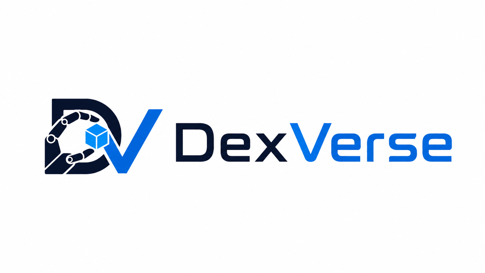

<p align="center">
  
</p>

<h1 align="center">DexVerse: A Modular Benchmark for Multi-Task, Multi-Embodiment Dexterous Manipulation</h1>

<p align="center">
  Yunchao Yao<sup>1*</sup>, Zhuxiu Xu<sup>1,2*</sup>, Tianqi Zhang<sup>1</sup>, Zixian Liu<sup>1</sup>, Sikai Li<sup>1</sup>, Zhenyu Wei<sup>1</sup>, Feng Chen<sup>2</sup>, Dihong Huang<sup>1</sup>,<br/>
  Kechang Wan<sup>1</sup>, Chenyang Ma<sup>1</sup>, Shuqi Zhao<sup>3</sup>, Shenghua Gao<sup>2</sup>, Masayoshi Tomizuka<sup>3</sup>, Yi Ma<sup>2</sup>, Mingyu Ding<sup>1†</sup>
</p>

<p align="center">
  <sup>1</sup>UNC-Chapel Hill &nbsp;&nbsp; <sup>2</sup>University of Hong Kong &nbsp;&nbsp; <sup>3</sup>UC Berkeley<br/>
  <sup>*</sup>Equal contribution &nbsp;&nbsp; <sup>†</sup>Corresponding author
</p>

<p align="center">
  🌐 <a href="https://ycyao216.github.io/DexVerse.site/"><strong>Project Page</strong></a>
</p>


## Release Roadmap

- [x] Initial release: task suite, assets
- [ ] Release full teleoperation and data-collection tooling and corresponding documentations
- [ ] Baseline environment demonstrations and baseline code
- [ ] Full shadowhand demonstration dataset
- [ ] Cross-embodiment robot assets, instructions, and demonstrations

---

This repository is the official codebase for **DexVerse**, a benchmark for tabletop dexterous
manipulation built on [Isaac Lab](https://github.com/isaac-sim/IsaacLab). 
**Docs:** `source/dexverse/docs/envdocs.md` lists the registered tasks.

## Repository Structure

The repository is organized as an Isaac Lab extension project: the installable Python package lives
under `source/dexverse`, and runnable entry points live under `scripts/`. Large binary files (robot
and object assets, demonstrations) are downloaded from Hugging Face
into this tree during setup (see [Downloading Assets](#downloading-assets) below).

```
DexVerse/
├── source/dexverse/                 # Installable Python package (the Isaac Lab extension)
│   ├── dexverse/                        # Core package
│   │   ├── tasks/                           # Task/environment definitions and configs
│   │   ├── assets/                          # Asset configs (objects, scenes, background HDRIs, ...)
│   │   ├── devices/                         # Teleop input devices (OpenXR, retargeters)
│   │   ├── robot_agents/                    # Per-robot-hand configs
│   │   └── utils/                           # Shared utilities
│   ├── demonstrations/                  # Demonstration data (populated by download_demos.py)
│   ├── docker_utils/                    # Docker Compose patch for IsaacLab. 
│   └── docs/                            # Extension docs; envdocs.md lists all registered tasks
├── scripts/                         # Entry points and tooling (not installed as a package)
│   ├── list_envs.py                     # List registered tasks
│   ├── zero_agent.py / random_agent.py  # Dummy agents for sanity checks
│   ├── teleop_agent.py                  # Interactive (VR/keyboard/spacemouse) teleoperation
│   ├── record_demos.py                  # Demonstration recording
│   ├── run_dexverse.py                  # Joint-slider debug UI
│   ├── asset_tools/                     # Asset download utilities
│   └── demo_tools/                      # Demo download / conversion / inspection utilities
└── docs/                            # Repo-level docs (observation space, known hand issues)
```

## Installation

### Prerequisites

DexVerse runs on top of [NVIDIA Isaac Sim](https://developer.nvidia.com/isaac-sim) and
[Isaac Lab](https://github.com/isaac-sim/IsaacLab). We recommend using `conda` to manage the
python environment, and cloning Isaac Lab and DexVerse side by side in the same parent directory:

```
workspace/
├── IsaacLab/    # simulator framework (Isaac Lab v2.3.2)
└── DexVerse/    # this repository
```

The steps below install Isaac Sim 5.1.0 and Isaac Lab v2.3.2 into a fresh conda environment.
They mainly follow the [official Isaac Lab pip installation guide](https://isaac-sim.github.io/IsaacLab/main/source/setup/installation/pip_installation.html),
with two adjustments (marked `FIX`) that work around known dependency conflicts in that release:

```bash
# Create and activate a fresh environment (run from the workspace/ directory)
conda create -n dexverse python=3.11
conda activate dexverse
pip install --upgrade pip

# Install Isaac Sim 5.1.0
pip install "isaacsim[all,extscache]==5.1.0" --extra-index-url https://pypi.nvidia.com

# Install the CUDA 12.8 builds of PyTorch that Isaac Sim 5.1 is built against.
# FIX: we add torchaudio to the official guide's command here. With the exact expected
# torch version already present, Isaac Lab's installer skips its own torch reinstall step,
# which would otherwise uninstall torchaudio without restoring it.
pip install -U torch==2.7.0 torchvision==0.22.0 torchaudio==2.7.0 --index-url https://download.pytorch.org/whl/cu128

# Temporary fix to counter isaaclab v2.3.2 installation dependency breaks. Inspired by https://github.com/isaac-sim/IsaacLab/issues/4576 
pip install "setuptools==65.0.0"
pip install "flatdict==4.0.1" --no-build-isolation

# Install Isaac Lab v2.3.2
git clone https://github.com/isaac-sim/IsaacLab.git --branch v2.3.2
cd IsaacLab
sudo apt install cmake build-essential   # Linux system dependencies
./isaaclab.sh --install
```

> **Note**: during `./isaaclab.sh --install`, pip may still print dependency-resolver warnings. We will continue to monitor the effect of these conflicts.

### Install the DexVerse package

Most dependencies will be satisfied after IsaacLab installation. After IsaacLab is fully installed, from this repository root and in the same virtual environment that IsaacLab is installed to, install the extension (optionally in editable mode):

```bash
python -m pip install -e source/dexverse
```

This is all the core benchmark needs. The environments, teleoperation, demo recording and conversion run entirely on packages that ship with Isaac Lab's official environment.

### Optional: extras for the demo inspection tools

A few offline utilities under `scripts/demo_tools/` use packages that are *not* part of Isaac
Lab's official environment. Install them if you use these tools:

```bash
# opencv-python is capped and numpy is constrained on purpose: opencv-python >= 4.12
# requires numpy >= 2, but Isaac Sim 5.1 and Isaac Lab are built against numpy 1.26 and
# will break if numpy is upgraded to 2.x.
python -m pip install matplotlib "opencv-python<4.12" open3d imageio-ffmpeg "numpy<2"
```

## Downloading Assets

The robot hand and object/scene assets are not stored in the git repository. They are hosted on the gated
Hugging Face dataset [`dexverse/DexVerse_release`](https://huggingface.co/datasets/dexverse/DexVerse_release)
and must be downloaded before any environment can run. Log in once and accept the dataset terms:

```bash
pip install huggingface_hub
hf auth login   # and follow the prompt to login to hugging face
# alternatively, you can create hugging face tokens and set the environmetn HF_TOKEN=<your-token> 
```

### Robot hand assets

The robot hand configs (Python/YAML) ship with the repo, but the USD/URDF/mesh files they load are
downloaded separately. Fetch every available hand with:

```bash
python scripts/asset_tools/download_robot_agents.py --all
```

The bundles extract into `source/dexverse/dexverse/robot_agents/`, directly next to the configs
that use them. 


> **Note**: we currently release the Shadow hand. The remaining robot combinations are coming soon. 

### Object and scene assets

The tabletop objects, scenes, HDRI backgrounds, and the ManiTwin-100K object pool used by the
tasks are downloaded the same way. Fetch everything with:

```bash
python scripts/asset_tools/download_assets.py --all
```

The bundles extract into `source/dexverse/dexverse/assets/`. Note that `--all` pulls the full set
(core assets ~410 MB, ManiTwin object pool ~2.2 GB, HDRIs ~1.8 GB, plus long-horizon task meshes),
so expect a few GB of downloads.

With both downloads in place, every registered environment is functional. If you only need a
subset (a single hand, or just the core assets), both scripts support finer-grained flags — run
them with `--help`, or `download_robot_agents.py --list` to see the available hand bundles.

## Quick Start

Verify the installation by listing the registered tasks:

```bash
python scripts/list_envs.py
```

You can also run tasks with a dummy agent. This loads the full environment without needing demonstrations or a trained policy:

```bash
# apply zero actions every step
python scripts/zero_agent.py --task=<TASK_NAME>

# apply uniformly sampled random actions
python scripts/random_agent.py --task=<TASK_NAME>
```

If the simulator window opens and the scene steps without errors, the core installation is complete.
Pick any `<TASK_NAME>` from the `list_envs.py` output (the full catalog is documented in
`source/dexverse/docs/envdocs.md`), and use `--num_envs=<N>` to control how many parallel
environments are spawned.

## Demonstrations

> 🚧 **Data and Instructions Coming soon.** 

## Teleoperation and Data Collection

> 🚧 **Instructions Coming soon.**  


## Contact

For questions about the benchmark or this codebase, please don't hesitate to open a GitHub issue or directly reach out to:

- **Yunchao Yao** — [yunchaoy@cs.unc.edu](mailto:yunchaoy@cs.unc.edu)

## Citation

If you find DexVerse useful in your research, please cite:

```bibtex
@article{yao2026dexverse,
  title   = {DexVerse: A Modular Benchmark for Multi-Task, Multi-Embodiment Dexterous Manipulation},
  author  = {Yao, Yunchao and Xu, Zhuxiu and Zhang, Tianqi and Li, Sikai and Wei, Zhenyu and Chen, Feng and Huang, Dihong and Wan, Kechang and Ma, Chenyang and Zhao, Shuqi and Gao, Shenghua and Tomizuka, Masayoshi and Ma, Yi and Ding, Mingyu},
  journal = {arXiv preprint arXiv:2607.08751},
  year    = {2026}
}
```
 