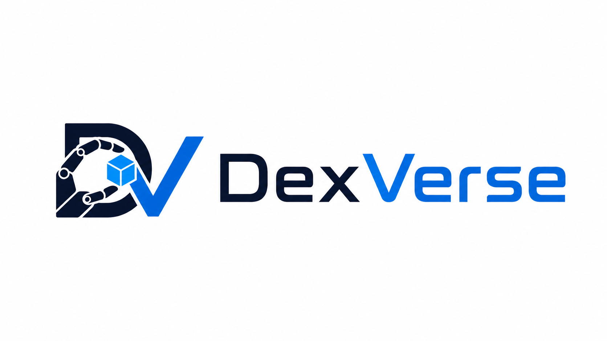

<p align="center">
  
</p>

<h1 align="center">DexVerse: A Modular Benchmark for Multi-Task, Multi-Embodiment Dexterous Manipulation</h1>

<p align="center">
  Yunchao Yao<sup>1*</sup>, Zhuxiu Xu<sup>1,2*</sup>, Tianqi Zhang<sup>1</sup>, Zixian Liu<sup>1</sup>, Sikai Li<sup>1</sup>, Zhenyu Wei<sup>1</sup>, Feng Chen<sup>2</sup>, Dihong Huang<sup>1</sup>,<br/>
  Kechang Wan<sup>1</sup>, Chenyang Ma<sup>1</sup>, Shuqi Zhao<sup>3</sup>, Shenghua Gao<sup>2</sup>, Masayoshi Tomizuka<sup>3</sup>, Yi Ma<sup>2</sup>, Mingyu Ding<sup>1†</sup>
</p>

<p align="center">
  <sup>1</sup>UNC-Chapel Hill &nbsp;&nbsp; <sup>2</sup> The University of Hong Kong &nbsp;&nbsp; <sup>3</sup>UC Berkeley<br/>
  <sup>*</sup>Equal contribution &nbsp;&nbsp; <sup>†</sup>Corresponding author
</p>

<p align="center">
  🌐 <a href="https://ycyao216.github.io/DexVerse.site/"><strong>Project Page</strong></a>
</p>

## Release Roadmap

- [x] Initial release: task suite, assets
- [x] Release teleoperation and data-collection tooling and corresponding documentations
- [x] Upgraded baseline tasks (`-v1`), alongside the original `-v0` tasks
- [ ] State-based Diffusion Policy (DP) and point-cloud DP3 training and evaluation
- [ ] Pi0.5 VLA baseline
- [ ] Full shadowhand demonstration dataset
- [ ] Cross-embodiment robot assets, instructions, and demonstrations

---

This repository is the official codebase for **DexVerse**, a benchmark for tabletop dexterous
manipulation built on [Isaac Lab](https://github.com/isaac-sim/IsaacLab). 
The `develop` branch includes the upgraded baseline tasks, demonstration tools,
and initial DP/DP3 baseline implementations. Start with the [DP and DP3 walkthrough](docs/baseline_training.md)
for demo preparation, dataset conversion, training, and a short policy rollout.
See [demo download and H5 conversion](docs/demo_conversion.md) for more selection options, or run
`python scripts/list_envs.py` for the registered task catalog.

## Repository Structure

The repository is organized as an Isaac Lab extension project: the installable Python package lives
under `source/dexverse`, and runnable entry points live under `scripts/`. Large binary files (robot
and object assets, demonstrations) are downloaded from Hugging Face
into this tree during setup (see [Downloading Assets](#downloading-assets) below).

```
DexVerse/
├── source/dexverse/                 # Installable Python package (the Isaac Lab extension)
│   ├── dexverse/                        # Core package
│   │   ├── tasks/                           # Task/environment definitions and configs
│   │   ├── baseline_v1/                     # Upgraded versions of the 20 baseline tasks
│   │   ├── assets/                          # Asset configs (objects, scenes, background HDRIs, ...)
│   │   ├── devices/                         # Teleop input devices (OpenXR, retargeters)
│   │   ├── robot_agents/                    # Per-robot-hand configs
│   │   ├── IL/                              # Imitation-learning baselines (DP and DP3)
│   │   └── utils/                           # Shared utilities
│   ├── demonstrations/                  # Demonstration data (populated by download_demos.py)
│   └── docker_utils/                    # Docker Compose patch for IsaacLab
├── scripts/                         # Entry points and tooling (not installed as a package)
│   ├── list_envs.py                     # List registered tasks
│   ├── zero_agent.py / random_agent.py  # Dummy agents for sanity checks
│   ├── teleop_agent.py                  # Interactive VR teleoperation
│   ├── record_demos.py                  # Demonstration recording
│   ├── run_dexverse.py                  # Joint-slider debug UI
│   ├── asset_tools/                     # Asset download utilities
│   ├── demo_tools/                      # Demo download / conversion / inspection utilities
│   ├── diffusion/                       # State-based Diffusion Policy baseline
│   └── dp3/                             # Point-cloud-based Diffusion Policy baseline
├── datastorage/                     # Host-mounted demo output (Docker; gitignored contents)
└── docs/                            # Demo conversion guide and project images
```


## Installation


### Prerequisites

DexVerse runs on top of [NVIDIA Isaac Sim](https://developer.nvidia.com/isaac-sim) and
[Isaac Lab](https://github.com/isaac-sim/IsaacLab). We recommend using `conda` to manage the
python environment, and cloning Isaac Lab and DexVerse side by side in the same parent directory:

```
workspace/
├── IsaacLab/    # simulator framework (Isaac Lab v2.3.2)
└── DexVerse/    # this repository
```

The steps below install Isaac Sim 5.1.0 and Isaac Lab v2.3.2 into a fresh conda environment.
They mainly follow the [official Isaac Lab pip installation guide](https://isaac-sim.github.io/IsaacLab/main/source/setup/installation/pip_installation.html),
with two adjustments (marked `FIX`) that work around known dependency conflicts in that release:

```bash
# Create and activate a fresh environment (run from the workspace/ directory)
conda create -n dexverse python=3.11
conda activate dexverse
pip install --upgrade pip

# Install Isaac Sim 5.1.0
pip install "isaacsim[all,extscache]==5.1.0" --extra-index-url https://pypi.nvidia.com

# Install the CUDA 12.8 builds of PyTorch that Isaac Sim 5.1 is built against.
# FIX: we add torchaudio to the official guide's command here. With the exact expected
# torch version already present, Isaac Lab's installer skips its own torch reinstall step,
# which would otherwise uninstall torchaudio without restoring it.
pip install -U torch==2.7.0 torchvision==0.22.0 torchaudio==2.7.0 --index-url https://download.pytorch.org/whl/cu128

# Temporary fix to counter isaaclab v2.3.2 installation dependency breaks. Inspired by https://github.com/isaac-sim/IsaacLab/issues/4576 
pip install "setuptools==65.0.0"
pip install "flatdict==4.0.1" --no-build-isolation

# Install Isaac Lab v2.3.2
git clone https://github.com/isaac-sim/IsaacLab.git --branch v2.3.2
cd IsaacLab
sudo apt install cmake build-essential   # Linux system dependencies
./isaaclab.sh --install
```

> **Note**: during `./isaaclab.sh --install`, pip may still print dependency-resolver warnings. We will continue to monitor the effect of these conflicts.


### Install the DexVerse package

After installing Isaac Lab, clone `develop` to use the upgraded tasks and both
baselines. Run this from the parent directory containing `IsaacLab/`:

```bash
git clone --branch develop https://github.com/ycyao216/DexVerse.git
cd DexVerse
```

Most dependencies will be satisfied after IsaacLab installation. From this repository root and in the same virtual environment that IsaacLab is installed to, install the extension (optionally in editable mode):

```bash
python -m pip install -e source/dexverse
```

This is all the core benchmark needs. The environments, teleoperation, demo recording and conversion run entirely on packages that ship with Isaac Lab's official environment.

### Optional: extras for the demo inspection tools

A few offline utilities under `scripts/demo_tools/` use packages that are *not* part of Isaac
Lab's official environment. Install them if you use these tools:

```bash
# opencv-python is capped and numpy is constrained on purpose: opencv-python >= 4.12
# requires numpy >= 2, but Isaac Sim 5.1 and Isaac Lab are built against numpy 1.26 and
# will break if numpy is upgraded to 2.x.
python -m pip install matplotlib "opencv-python<4.12" open3d imageio-ffmpeg "numpy<2"
```


## Downloading Assets

The robot hand and object/scene assets are not stored in the git repository. They are hosted on the public
Hugging Face dataset [`dexverse/DexVerse_release`](https://huggingface.co/datasets/dexverse/DexVerse_release)
and must be downloaded before any environment can run. No Hugging Face login is required:

```bash
pip install huggingface_hub
```

Robot, asset, and demo downloaders default to this release. Use `--repo OWNER/DATASET`
to override it; `hf auth login` is only needed if that dataset requires authentication.


### Robot hand assets

The robot hand configs (Python/YAML) ship with the repo, but the USD/URDF/mesh files they load are
downloaded separately. Fetch every available hand with:

```bash
python scripts/asset_tools/download_robot_agents.py --all
```

The bundles extract into `source/dexverse/dexverse/robot_agents/`, directly next to the configs
that use them. 

The following Python/YAML configurations are available in both v0 and v1 environments:

| Hand | `--robot_type` values |
| --- | --- |
| Shadow | `floating_shadow_right`, `floating_shadow_left`, `floating_shadow_bimanual` |
| Allegro | `floating_allegro_right`, `floating_allegro_left`, `floating_allegro_bimanual` |
| Inspire | `floating_inspire_right`, `floating_inspire_left`, `floating_inspire_bimanual` |
| Leap | `floating_leap_right`, `floating_leap_bimanual` (alias: `bimanual_leap`) |
| Sharpa Wave | `floating_sharpa_right`, `floating_sharpa_left`, `floating_sharpa_bimanual` |
| Wuji | `floating_wuji_right`, `floating_wuji_left`, `floating_wuji_bimanual` |

Both DexPilot and vector finger retargeting configs are included. For example, add
`--robot_type floating_allegro_right` to a compatible single-hand task command, or
`--robot_type floating_allegro_bimanual` to a bimanual task command.

**Asset availability:** the public Hugging Face release provides USD/URDF/mesh bundles
for all six hand families above. `--all` downloads them into
`source/dexverse/dexverse/robot_agents/`. FR3+Sharpa is excluded.
See the [asset release notes](https://huggingface.co/datasets/dexverse/DexVerse_release/blob/main/robot_agents/README.md)
for bundle details and validation coverage.

Single-hand Allegro and Inspire support task-specific wrist initialization for both
right and left hands in v0 and v1, including the pan and obstacle-slope tasks.

**Current task limits:** local smoke tests found insufficient commanded wrist/finger
response for Allegro/Leap bimanual in
`Dexverse-BimanualLiftTray-v1`; both passed the v0 tray task. Registration and successful
retargeting therefore do not imply that every task is ready for every hand.


### Object and scene assets

The tabletop objects, scenes, HDRI backgrounds, and the ManiTwin-100K object pool used by the
tasks are downloaded the same way. Fetch everything with:

```bash
python scripts/asset_tools/download_assets.py --all
```

The bundles extract into `source/dexverse/dexverse/assets/`. Note that `--all` pulls the full set
(core assets ~410 MB, ManiTwin object pool ~2.2 GB, HDRIs ~1.8 GB, plus long-horizon task meshes),
so expect a few GB of downloads.

Some tasks require additional generated assets; see [baseline task versions](#baseline-task-versions).
If you only need a subset (a single hand, or just the core assets), both scripts support finer-grained flags — run
them with `--help`, or `download_robot_agents.py --list` to see the available hand bundles.

## Quick Start

Verify the installation by listing the registered tasks:

```bash
python scripts/list_envs.py
```

You can also run tasks with a dummy agent. This loads the full environment without needing demonstrations or a trained policy:

```bash
# apply zero actions every step
python scripts/zero_agent.py --task=<TASK_NAME> --enable_cameras --num_envs=1

# apply uniformly sampled random actions
python scripts/random_agent.py --task=<TASK_NAME> --enable_cameras --num_envs=1 
```

If the simulator window opens and the scene steps without errors, the core installation is complete.
Pick any `<TASK_NAME>` from the `list_envs.py` output, and use `--num_envs=<N>`
to control how many parallel environments are spawned.

## Teleoperation and Data Collection

Our VR teleoperation and demonstration-recording pipeline is built on top of Isaac Lab's
[CloudXR teleoperation guide](https://isaac-sim.github.io/IsaacLab/main/source/how-to/cloudxr_teleoperation.html). That workflow streams the simulation to an XR headset (e.g. Apple Vision Pro) over NVIDIA CloudXR and sends hand-tracking inputs back to control the robot. It also has visualizations explaining the UI of the teleoperation app. 

**Docker is the currently recommended way to set up the CloudXR runtime and its dependencies.** Isaac Lab
ships Docker Compose patches that run the simulator and CloudXR runtime together. We additionally provide an
additional patch to mount this repository into the container (see
`source/dexverse/docker_utils/README.md` for details).

### Prerequisites

Before starting, you can install Docker following the [official instructions](https://docs.docker.com/engine/install/).
The CloudXR guide also lists [system requirements](https://isaac-sim.github.io/IsaacLab/main/source/how-to/cloudxr_teleoperation.html#system-requirements) (GPU, RAM, XR device, network) and firewall rules for the streaming ports. It is also necessary to connect both the Apple Vision Pro to the same wireless network as the one used by the machine running  DexVerse. Also make sure the wireless network setting allows direct connection (can verify using ping). Internet connection is not required for the Apple Vision Pro to communicate with the machine running DexVerse. 

### Start the demonstration collection environment: Docker Compose with CloudXR

The easiest way to start the container is from the Isaac Lab repository root. This starts the Isaac Lab and CloudXR runtime containers together. If prompted, enable X11 forwarding so the Isaac Sim UI is visible on the host.

```bash
cd /path/to/IsaacLab
./docker/container.py start \
    --files docker-compose.cloudxr-runtime.patch.yaml \
            ../../DexVerse/source/dexverse/docker_utils/docker-compose.dexverse.patch.yaml \
    --env-files .env.cloudxr-runtime
```

Enter the Isaac Lab base container:

```bash
./docker/container.py enter base
```

Inside the container, install DexVerse once (the repo is bind-mounted at `/workspace/dexverse`):

```bash
cd /workspace/dexverse
python -m pip install -e source/dexverse
```

In the Isaac Sim UI, open the **AR** panel, set **Selected Output Plugin** to **OpenXR** and
**OpenXR Runtime** to **System OpenXR Runtime**, then click **Start AR**. Connect from your XR client as described in the [Apple Vision Pro section](https://isaac-sim.github.io/IsaacLab/main/source/how-to/cloudxr_teleoperation.html#use-apple-vision-pro-for-teleoperation) of the Isaac Lab guide.

When finished, stop the containers from the Isaac Lab root:

```bash
./docker/container.py stop \
    --files docker-compose.cloudxr-runtime.patch.yaml \
            ../../DexVerse/source/dexverse/docker_utils/docker-compose.dexverse.patch.yaml \
    --env-files .env.cloudxr-runtime
```

> **Note**: paths in `--files` are resolved relative to `IsaacLab/docker` and assume DexVerse is  
> cloned next to Isaac Lab under the same parent directory. If your layout differs, you can set  
> `DEXVERSE_PATH=/abs/path/to/DexVerse` before running `container.py`.


### Baseline task versions

The 20 baseline task families have paired `-v0` (original) and `-v1` (upgraded)
environments. Select the version in the task ID, for example
`Dexverse-PushT-v0` or `Dexverse-PushT-v1`.
Original tasks remain in `dexverse/tasks/`; their baseline upgrades live beside
them in `dexverse/baseline_v1/`. This is task versioning, not a separate benchmark release.

**Control compatibility:** v1 reuses the shared robot definitions but keeps its
collection/control differences in `baseline_v1/control_profile.py`: floating
Shadow wrist simulation/command limits are ±2π, and vector retargeting uses
`low_pass_alpha=0.2` and `scaling_factor=1.125` for both hands (v0: alpha 0.8,
left scale 1.3, right scale 1.125). The filter/scale affect teleop collection;
wrist limits also affect policy execution. These explicit overrides preserve
the v1 setup without duplicating robots or changing v0. Matching action shapes
do not make a v0-trained policy compatible with v1; validate the task and control
settings before transferring policies.

```bash
python scripts/list_envs.py --baseline --version all --names_only
```

Both versions use the same benchmark prerequisites. Before running the cutaway
door v1 task, generate its USD from the supplied URDF:

```bash
python scripts/asset_tools/convert_cutaway_door.py --headless
```

### Debug teleoperation (`teleop_agent.py`)

Use `scripts/teleop_agent.py` to test VR teleop, retargeting, and task setup **without** writing demos to disk.  

```bash
cd /workspace/dexverse
./isaaclab.sh -p scripts/teleop_agent.py \
    --task Dexverse-PickUpStick-v0 \
    --teleop_device handtracking \
    --enable_pinocchio
```

Common optional flags:

- `--robot_type`  — override the robot variants
- `--teleop_retargeter relative|absolute` — wrist retargeting mode (default: `relative`). `relative` takes the pose of the operator's wrist when the teleoperation process is started. `absolute` directly take the pose of the operator's wrist in the simulator's frame and match the robot's wrist link to that.  
- `--retargeting_scheme dexpilot|vector` — finger retargeting optimizer (default: `dexpilot`)
- `--enable_debug_vis` — show zone / reference-point markers in the viewport

The debug switch also controls v1 hand-tracking dots and current-object frames.
The same controls are available in zero-agent and recording; use
`--cues_in_rgb` / `--no-cues_in_rgb` to choose camera visibility separately.
Task-defining goals remain visible.

Use START / STOP / RESET from the XR client to control the session (more details see the official IsaacLab CloudXR guide).

### Record demonstrations (`record_demos.py`)

Once teleop feels good, switch to `scripts/record_demos.py` to save trajectory pickles. It uses the
same VR stack as `teleop_agent.py`, but additionally records per-step actions and scene states and
auto-saves when the task success condition is met.

The Docker patch mounts `datastorage/` into the container and sets `DEXVERSE_DATA_DIR`, so  
recordings land on the host under `DexVerse/datastorage/`. Pass `--dataset_dir` only to choose a subfolder (for example `grasping, or can leave blank`):

```bash
cd /workspace/dexverse
./isaaclab.sh -p scripts/record_demos.py \
    --task Dexverse-PickUpStick-v0 \
    --dataset_dir grasping \
    --teleop_device handtracking \
    --enable_pinocchio \
    --num_demos 50 \
    --num_success_steps 10
```

By default, output path on the host: `DexVerse/datastorage/grasping/Dexverse-PickUpStick-v0/<TASK>_<timestamp>.pkl`. File names can also be specified. See output of `--help` for other argument options. 

New recordings include the selected `task_version`, `benchmark_revision`, and `action_layout`.
Use `--device cpu` for consistent collection/replay device selection and
`--seed N` to seed collection randomness; this does not guarantee identical physics
across machines. The resolved seed is saved in each session. Teleop and zero-agent
also accept `--seed`.

Each pickle includes per-step scene states (`record_state` is always on), plus per-episode
command and task-buffer state used to reconstruct randomized goals and their visual markers.
Use START to begin recording an episode; a demo is saved after `--num_success_steps`
consecutive successful steps. To see other arguments, use `--help`. Smooth teleoperation also
depends on CPU, GPU, and network condition.

### Basic replaying and converting demos (`--set-state`)

Isaac Sim / PhysX dynamics can differ slightly across GPUs and driver versions, so replaying
recorded **actions** step-by-step on another machine may drift from the original trajectory.

When converting pickles to HDF5, use `scripts/demo_tools/create_demo_files_sequential.py`
with `--set-state` (the default) to restore recorded scene states at each timestep.
This is not a guarantee of identical contact observations or successful action-driven replay.

```bash
python scripts/demo_tools/create_demo_files_sequential.py \
    --file datastorage/grasping/Dexverse-PickUpStick-v0/<TASK>_<timestamp>.pkl \
    --set-state
```

Pass `--no-set-state` only if you explicitly want true action replay. See `create_demo_files_sequential.py --help` for the full set of output and selection options.

For curated baseline demos, select the task **including its version**:

```bash
# Download all available v0 AND v1 baselines (reports missing sets).
python scripts/demo_tools/download_demos.py --repo dexverse/DexVerse_release --baseline

# Or download one exact task/version.
python scripts/demo_tools/download_demos.py --repo dexverse/DexVerse_release --task Dexverse-PushT-v1

# Convert that task's curated demos.pkl; change -v1 to -v0 for the original task.
python scripts/demo_tools/create_demo_files_sequential.py \
    --task Dexverse-PushT-v1 --obs-groups state --device cpu \
    --set-state --output-dir outputs/h5
```

Output is `outputs/h5/v1/non_prehensile/Dexverse-PushT-v1/Dexverse-PushT-v1.state.seq.demo.h5`.
All 50 trajectories in a complete set are converted by default. Task selection
never recursively merges collection sessions or substitutes another version.
Use `--dry-run` to inspect selection without starting the simulator; use
`--demos-root PATH` for a different download directory or prepared local release.
Raw-session conversion remains available through `--file PATH` or the explicit
`--legacy-collections` option. See [versioned H5 conversion](docs/demo_conversion.md).

#### Observation modes (`--obs-groups`)

You choose which observations end up in the HDF5 with `--obs-groups`. It accepts either a
single **preset** name (which narrows the env's observation space before it is built) or an
explicit **list of group names**. When omitted, every active observation group on the env is
captured, and downstream consumers can select the subset they need.

Available presets:


| Preset                                 | Enabled groups                        | Notes                         |
| -------------------------------------- | ------------------------------------- | ----------------------------- |
| `rgb`                                  | policy, proprio, goal, rgb            | single view, history length 3 |
| `rgb_depth` (alias `rgbd`)             | policy, proprio, goal, rgb, depth     | single view, history length 3 |
| `pointcloud`                           | policy, proprio, goal, pointcloud     | single view, history length 3 |
| `state`                                | policy, proprio, contact, state, goal | no image history              |
| `3view_rgb`                            | policy, proprio, goal, rgb            | three camera views            |
| `3view_rgb_depth` (alias `3view_rgbd`) | policy, proprio, goal, rgb, depth     | three camera views            |
| `3view_pointcloud`                     | policy, proprio, goal, pointcloud     | three camera views            |


```bash
# Preset (narrows the obs space to RGB + proprio/goal):
python scripts/demo_tools/create_demo_files_sequential.py \
    --file datastorage/grasping/Dexverse-PickUpStick-v0/<TASK>_<timestamp>.pkl \
    --obs-groups rgb

# Explicit group list (captures exactly these groups):
python scripts/demo_tools/create_demo_files_sequential.py \
    --file datastorage/grasping/Dexverse-PickUpStick-v0/<TASK>_<timestamp>.pkl \
    --obs-groups proprio rgb depth
```

Image storage dtypes are configurable with `--rgb-dtype` (`uint8` default, or `float32`) and
`--depth-dtype` (`float16` default, or `float32`).

#### Recording a plain camera video for quick debugging during conversion (`--record-video`)

`create_demo_files_sequential.py` can also write one MP4 per episode straight from a scene camera while it replays, which is handy for sanity-checking a conversion run. This is a raw camera render for debug purpose and is not affected by the choice of observation modes.

```bash
python scripts/demo_tools/create_demo_files_sequential.py \
    --file datastorage/grasping/Dexverse-PickUpStick-v0/<TASK>_<timestamp>.pkl \
    --record-video \
    --video-camera third_person_camera \
    --video-fps 30 \
    --video-dir outputs/replay_videos
```

`--video-dir` defaults to a `videos/` sibling of each HDF5 output.

### Rendering debug videos from an H5 (`render_demo_video.py`)

`We also provide scripts/demo_tools/render_demo_video.py` that takes an observation HDF5 file (the output of the converter) and renders a composited and more complete debug MP4 for a trajectory. The layout is: all visual streams (RGB / depth / point cloud) on the left, an action heatmap with a moving step bar on the upper right, and a per-step observation/state text panel on the lower right (showing the file's `obs_groups` / preset and a summary of numeric obs terms).

```bash
python scripts/demo_tools/render_demo_video.py \
    --dataset_file datastorage/grasping/Dexverse-PickUpStick-v0/Dexverse-PickUpStick-v0.demo.h5 \
    --episode 0 \
    --output outputs/demo_videos/pickup_stick_demo0.mp4 \
    --fps 15
```

Use `--episode all` (or `*`) to render every episode into separate MP4s (written under
`--output-dir`, or next to the source H5). Restrict the text panel with `--obs-display-groups`
(e.g. `proprio goal contact`), and add `--include_next_obs` to also plot `next_obs/*` streams.
When `--output` is omitted, the MP4 is written as `<h5-stem>__demo_<idx>.mp4` beside the source
file. See `render_demo_video.py --help` for figure size, DPI, and other options.

See also `source/dexverse/docker_utils/README.md` for Docker mount details.

## Demonstrations

See [demo download and H5 conversion](docs/demo_conversion.md) for versioned task
selection. The dataset manifest lists available recordings; the dataset card
specifies their license. Demonstrations are distributed separately from the code.

```bash
# Download available curated demonstrations for both baseline task versions.
python scripts/demo_tools/download_demos.py --baseline
```

## Imitation-Learning Baselines

DP/DP3 training and evaluation are still in progress. The walkthrough below
provides commands for initial pipeline checks.

State-based [Diffusion Policy](https://diffusion-policy.cs.columbia.edu/) lives in
`dexverse.IL.diffusion`, with entry points in `scripts/diffusion/`.
[DP3](source/dexverse/dexverse/IL/dp3/README.md) uses point clouds and proprioception,
with entry points in `scripts/dp3/`. Install their optional dependencies with:

```bash
python -m pip install -e "source/dexverse[dp3]"
```

Follow the **[DP and DP3 walkthrough](docs/baseline_training.md)** to download
50 PushT v1 demonstrations, generate observation H5s, build both training
datasets, train for two epochs, and load each checkpoint for a short simulator
rollout. It includes commands and the output files to check at each stage.

| Baseline | Replay preset (`--obs-groups`) | Build the training dataset | Train / evaluate |
| --- | --- | --- | --- |
| DP | `state` | `scripts/diffusion/build_dataset.py` | `scripts/diffusion/train.py` / `eval_online.py` |
| DP3 | `pointcloud` | `scripts/dp3/convert_demos_to_dp3.py` | `scripts/dp3/train.py` / `eval_online.py` |

The walkthrough uses CPU physics for conversion and evaluation, and CUDA for
neural-network training. Two epochs check that the pipeline runs; longer
training and evaluation are needed to assess task success.

Keep the task version and observation preset consistent through conversion,
training, and evaluation. The state converter records observation-term order so
DP can reconstruct the same state layout at training and evaluation time.

## Contact

For questions about the benchmark or this codebase, please don't hesitate to open a GitHub issue or directly reach out to:

- **Yunchao Yao** — [yunchaoy@cs.unc.edu](mailto:yunchaoy@cs.unc.edu)


## Citation

If you find DexVerse useful in your research, please cite:

```bibtex
@article{yao2026dexverse,
  title   = {DexVerse: A Modular Benchmark for Multi-Task, Multi-Embodiment Dexterous Manipulation},
  author  = {Yao, Yunchao and Xu, Zhuxiu and Zhang, Tianqi and Li, Sikai and Wei, Zhenyu and Chen, Feng and Huang, Dihong and Wan, Kechang and Ma, Chenyang and Zhao, Shuqi and Gao, Shenghua and Tomizuka, Masayoshi and Ma, Yi and Ding, Mingyu},
  journal = {arXiv preprint arXiv:2607.08751},
  year    = {2026}
}
```
